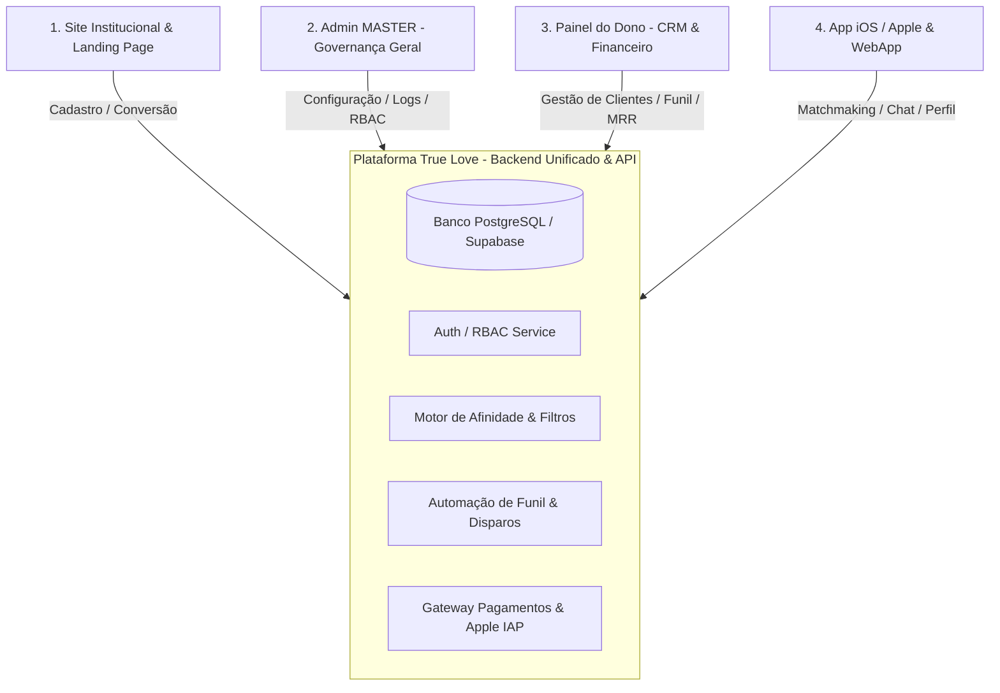

# True Love APP Oficial — Plano Arquitetural e de Engenharia

Este documento consolida a análise detalhada dos arquivos de design ([DESIGN.md](file:///c:/Users/Corttex/Desktop/@truelove/MDs%20ref/DESIGN.md), [SKILL.md](file:///c:/Users/Corttex/Desktop/@truelove/MDs%20ref/SKILL.md)), do protótipo funcional online (`https://true-love-app-oficial.luisangelobsb.chatgpt.site/?v=modern-public`) e a especificação para transformar o projeto em uma **aplicação robusta, escalável e de nível comercial**.

---

## 1. Diagnóstico do Material Existente

### 1.1. O que foi extraído do protótipo web
- **Público-alvo:** Público maduro (35+ anos) no Brasil que busca conexões intencionais e relacionamentos sérios.
- **Motor de Afinidade (`affinity`):** Algoritmo ponderado (Jaccard) baseado em cidade, interesses mútuos, valores morais/familiares, estilo de vida e metas de relacionamento, com filtros de exclusão recíprocos (ex: faixa etária recíproca, cidade obrigatória, bloqueios ativos).
- **Reciprocidade Estrita:** O chat só é liberado mediante interesse mútuo (*double opt-in*), evitando spam e assédio.
- **Privacidade & LGPD:** Proteção de dados sensíveis (crença/religião como opt-in exclusivo para match, sem repasse para analytics), auditoria, exportação de dados e fluxo de anonimização.
- **Limitação Atual:** Toda a persistência é baseada em `localStorage` e simulações mock, em código JavaScript puro sem separação de responsabilidades para ambientes multi-usuário em tempo real.

### 1.2. Design System e Tokens ([DESIGN.md](file:///c:/Users/Corttex/Desktop/@truelove/MDs%20ref/DESIGN.md))
- **Cores Semânticas:**
  - Primária/Hero: Verde Floresta Profundo (`#14534f` / `#173e3a` / `#263330`)
  - Acentos Românticos: Rosa Pó / Blush (`#f7e9ec` / `#ead8d4` / `#c5636d`) e Ouro/Bronze (`#ad7840` / `#a95560`)
  - Superfícies: Off-white / Papel Linho (`#f7f8f5` / `#fbfaf6`), Bordas Suaves (`#dce3dd`)
- **Tipografia:** Georgia/Editorial Serif nos títulos para transmitir elegância, sobriedade e maturidade; Inter nos textos operacionais para legibilidade WCAG 2.2 AA.

---

## 2. Os 4 Pilares da Aplicação



---

### Pilar 1: Site Institucional & Landing Page (Pública)
Objetivo: Atração, autoridade, conversão e download.

- **Hero Section de Alto Impacto:**
  - Proposta de valor clara: *"Onde pessoas maduras encontram conversas verdadeiras e relacionamentos sérios"*.
  - Call-to-actions claros: "Cadastrar-se Gratuitamente", "Baixar na App Store", "Acessar Plataforma Web".
- **Apresentação dos Diferenciais:**
  - *Matching Explicável:* Você sabe exatamente por que uma pessoa foi apresentada.
  - *Verificação 35+:* Sem fakes ou bots, validação com biometria facial e documentos.
  - *Privacidade Absoluta:* Localização aproximada por cidade/estado, sem exibição de endereço ou dados de contato.
  - *Concierge Humano:* Curadoria opcional por matchmakers especializados.
- **Tabela de Planos Transparentes:**
  - **Free:** Perfil verificado, apresentações diárias, reciprocidade e chat mútuo.
  - **Plus:** Filtros avançados por cidade/estado, ver quem curtiu, rebobinar perfis.
  - **Concierge VIP:** Curadoria humana dedicada, feedback do matchmaker e introduções personalizadas.
- **Histórias de Sucesso / Casos Reais & FAQ:** Perguntas frequentes sobre segurança, cobrança e suporte.

---

### Pilar 2: Admin MASTER (Super Admin do Sistema)
Objetivo: Governança técnica, segurança, auditoria e controle de acessos da equipe.

- **Gestão Granular de Permissões (RBAC):**
  - Matriz de papéis: `super_admin`, `moderator`, `support`, `matchmaker`, `finance`.
  - Atribuição e revogação de acessos de operadores com 2FA obrigatório.
- **Logs de Auditoria e Conformidade LGPD:**
  - Registro de todas as ações sensíveis (quem visualizou perfis, alterações em cadastros, banimentos, requisições de exclusão de dados).
- **Parametrização do Algoritmo de Matching:**
  - Ajuste de pesos do algoritmo ponderado (distância geográfica, afinidade de valores, interesses em comum, faixa etária).
- **Saúde do Sistema e Integrações:**
  - Status de filas de emails/SMS/WhatsApp, webhooks de pagamento e status da API da Apple.

---

### Pilar 3: Painel do Dono (CRM, Gestão de Cadastros, Funil e Financeiro)
Objetivo: A ferramenta operacional do fundador para escalar o faturamento e a retenção de usuários.

- **CRM 360° e Gestão de Cadastros:**
  - Visualização unificada do cliente: dados cadastrais, nível de preenchimento do perfil, fotos enviadas, status de verificação documental (Aprovado / Pendente / Rejeitado).
  - Linha do tempo de interações (quando entrou, último login, quantas conexões ativas, conversas iniciadas).
  - Notas internas privadas para o dono ou operadores (ex: *"Cliente VIP, prefere parceiros do Rio de Janeiro"*).
- **Filtros Avançados de Clientes:**
  - Filtro por Cidade, Estado, Raio Geográfico e Faixa Etária.
  - Filtro por "Densidade de Matching" (*Matchable Density*) para identificar cidades com falta de homens ou mulheres e direcionar campanhas.
  - Filtro por comportamento: Inativos há mais de X dias, usuários com 0 conexões, usuários muito ativos, inadimplentes.
- **Automação de Funil de Possíveis Usuários:**
  - **Funil em Estágios (Visual Kanban):**
    1. *Lead Captado / Cadastro Inicial Incompleto*
    2. *Perfil em Análise / Documento Pendente*
    3. *Ativo sem Interação (precisa de incentivo)*
    4. *Interesse Enviado sem Resposta*
    5. *Conexão Estabelecida (Match)*
    6. *Conversando no Chat*
    7. *Membro Pago (Plus/Concierge)*
    8. *Risco de Churn / Inativo*
  - **Gatilhos de Automação Inteligente:**
    - Se o usuário cadastrou mas não completou o perfil em 24h -> disparar mensagem de suporte / boas-vindas.
    - Se um perfil elegível com mais de 85% de compatibilidade se cadastrar na mesma cidade -> notificar ambos os lados.
    - Se o usuário teve um match mas não iniciou conversa em 48h -> enviar sugestão de quebra-gelo respeitosa.
- **Dashboard Financeiro Executivo:**
  - MRR (Receita Recorrente Mensal), ARR, Total de Assinaturas Ativas por Plano (Free, Plus, Concierge).
  - Churn de assinaturas, reembolsos solicitados, inadimplência e taxa de conversão do funil Free -> Plus -> Concierge.

---

### Pilar 4: App iOS / Apple
Objetivo: A experiência premium no bolso do usuário maduro, seguindo a estética e rigor da Apple.

- **Diretrizes Apple HIG (Human Interface Guidelines):**
  - Tab Bar nativa na base da tela (Descoberta, Conexões, Mensagens, Meu Perfil, Concierge/Ajuda).
  - Safe Areas respeitadas (Dynamic Island, Notch, barra inferior do iPhone).
  - Feedback tátil (*Haptic Feedback*) ao curtir, enviar mensagem ou dar match.
  - Tipografia fluida com Dynamic Type (ajustável para tamanhos de fonte maiores, essencial para o público 35+ e terceira idade).
- **Experiência de Descoberta Editorial:**
  - Cards imersivos com fotos em alta definição, apresentação elegante ("Currículo Afetivo"), selo de verificação e drawer explicativo de compatibilidade.
- **Chat em Tempo Real:**
  - Comunicação instantânea (WebSockets/Supabase Realtime) com notificações push nativas da Apple (APNs), indicador de leitura e segurança reforçada.
- **Integração Apple:**
  - Login com Apple (*Sign in with Apple*), biometria (Face ID / Touch ID) para login rápido e compras dentro do app via Apple In-App Purchase / StoreKit.

---

## 3. Modelo de Dados e Arquitetura de Banco (PostgreSQL)

```sql
-- Entidades Principais
users (id, email, phone, role, created_at, status)
profiles (id, user_id, name, birth_date, gender, city, state, bio, profession, status_text, relationship_goal, verified, tier, onboarding_step)
profile_photos (id, profile_id, photo_url, order_index, is_approved)
preferences (id, profile_id, min_age, max_age, same_city, shared_interests, shared_values)
interests (id, from_profile_id, to_profile_id, created_at)
matches (id, profile_a, profile_b, active, created_at)
messages (id, match_id, sender_profile_id, content, read_at, created_at)
reports (id, reporter_profile_id, reported_profile_id, reason, details, status)
concierge_cases (id, profile_id, assigned_admin_id, status, notes)
funnel_events (id, profile_id, stage, metadata, triggered_at)
subscriptions (id, user_id, tier, status, current_period_end, amount)
audit_logs (id, actor_user_id, action, resource_type, resource_id, metadata, timestamp)
```

---

## 4. Próximos Passos de Execução

1. **Definição da Stack:** TypeScript completo, Frontend em Next.js / Vite + React com componentes de alto luxo baseados nos tokens do projeto, Backend com banco de dados estruturado e containerização.
2. **Construção Modular:**
   - Módulo 1: O Painel do Dono (CRM + Filtros + Funil + Financeiro) para gerir toda a base.
   - Módulo 2: O Site Institucional & Landing Page.
   - Módulo 3: O Admin MASTER para auditoria e RBAC.
   - Módulo 4: O App iOS (Web PWA + Wrapper Capacitor / Native para iPhone).
