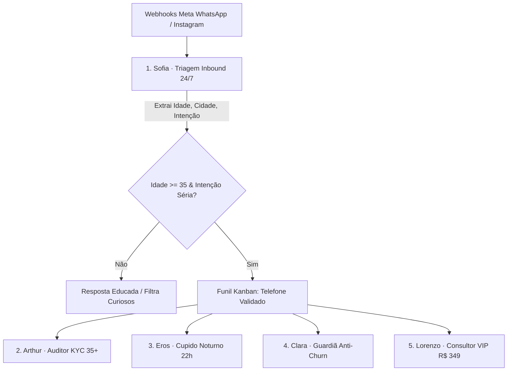

# ❤️ True Love APP Oficial — Registro Técnico & Arquitetural da V1.0

> **Versão:** 1.0.0 (Release de Produção)  
> **Público-Alvo:** Relacionamentos sérios e intencionais para pessoas maduras (35+ anos) no Brasil.  
> **Metodologia:** JEV (Jornada de Engenharia de Valor) orientada a conversão autônoma, redução de OpEx e automações 24/7.  
> **Status:** Homologado com 0 erros de compilação, Docker pronto para VPS, Webhooks Meta ativos e PWA/Capacitor configurados.

---

## 🧭 1. Mapa de Rotas e Links do Ecossistema V1

A aplicação opera com roteamento unificado e histórico de navegação nativo (`HTML5 History API`):

| Link / Rota | Superfície / Módulo | Finalidade e Capacidades Principais |
| :--- | :--- | :--- |
| **`/`** | **Site Institucional (Raiz)** | Landing page de alta autoridade, proposta de valor 35+, apresentação dos planos (Free, Plus, Concierge VIP), selo de segurança KYC e CTAs de conversão. |
| **`/adminmaster`** | **Admin MASTER (Super Admin)** | Centro de comando governamental: Equipe & Permissões RBAC, Cofre de Chaves de APIs & Tokens, Métricas em tempo real da VPS & Docker, Moderação de Denúncias, Calibração de Pesos do Algoritmo e Trilha de Auditoria LGPD. |
| **`/painel`** | **Painel do Dono (CRM & Gestão)** | Cockpit de negócio: CRM 360° com filtros avançados, Funil Kanban em 7 etapas, Gestor de Cadastros KYC 35+, Cockpit Financeiro MRR/ARR, Mapa de Densidade de Matching por capital e o Cockpit dos Agentes de IA com Simulador Inbound. |
| **`/api`** *(api.dominio)* | **Central de APIs & Webhooks** | Portal interativo do desenvolvedor com documentação de endpoints Meta WhatsApp, Instagram, Healthcheck, teste de payloads JSON e gerador de chamadas cURL, JavaScript Fetch e Python Requests. |
| **`/ios`** | **App iOS (Apple)** | Simulador nativo do **iPhone 16 Pro** respeitando as *Apple Human Interface Guidelines*, Dynamic Island, Apple Tab Bar, cards imersivos de afinidade e chat mútuo (double opt-in). |
| **`/android`** | **App Android (Google)** | Simulador nativo do **Google Pixel 9 Pro** respeitando as diretrizes do **Material Design 3 (Material You)**, Top App Bar, Bottom Navigation, FAB com elevação e comando de exportação de APK. |
| **`/automacoes`** | **Central de Automações (n8n)** | Orquestrador de workflows visuais integrado ao n8n Community Edition Self-Hosted (Custo Zero de licença), status de execução e réguas de funil. |

---

## 🤖 2. Motor de Agentes de IA Autônomos & Conexão Meta

O ecossistema implementa uma rede de **5 agentes de inteligência artificial** que operam de forma ininterrupta na VPS:



### Detalhamento dos Agentes:
1. **Sofia (Triagem Meta WhatsApp & Direct 24/7):**
   - **Modelo:** `GPT-4o` + Heurística Semântica Brasileira.
   - **Gatilho:** Webhook Meta em tempo real (`POST /v1/meta/webhook`).
   - **Função:** Captura mensagens de anúncios, extrai Nome, Idade, Cidade e Intenção. Se atender aos critérios de 35+ e relação séria, insere o lead no CRM e envia resposta imediata e acolhedora no WhatsApp.
2. **Arthur (Auditor KYC 35+):**
   - **Modelo:** `Claude 3.5 Sonnet`.
   - **Função:** Analisa fotos de CNH/RG e selfies enviadas para detectar montagens, inconsistências de data de nascimento e perfis fakes, gerando parecer antes da validação final do Dono.
3. **Eros (Cupido & Matchmaker Noturno):**
   - **Modelo:** `Gemini 1.5 Pro`.
   - **Gatilho:** Rotina cron noturna na VPS às 22:00.
   - **Função:** Cruza todos os perfis ativos na mesma cidade calculando afinidade Jaccard ponderada. Se a compatibilidade for $\ge 80\%$, emite notificação aos usuários.
4. **Clara (Guardiã Anti-Churn):**
   - **Modelo:** `Llama 3.3 70B`.
   - **Função:** Detecta matches parados há mais de 48h ou usuários inativos há 5 dias, redigindo sugestões de quebra-gelo personalizadas com base nos valores e hobbies mútuos.
5. **Lorenzo (Consultor Concierge VIP):**
   - **Modelo:** `GPT-4o`.
   - **Função:** Monitora perfis de alta exigência e apresenta os benefícios da curadoria humana do plano Concierge VIP de R$ 349/mês no momento propício.

---

## ⚡ 3. Gestor de Automações: n8n vs Hermes Server

### Decisão Técnica Homologada: **n8n Community Edition Self-Hosted**
- **100% Custo Zero de Licença:** Software de código aberto rodando no contêiner `truelove_n8n` na VPS. Sem limite de execuções, sem limite de disparos e sem cobranças adicionais em dólar.
- **Superioridade Profissional:** Possui nós visuais prontos para Meta WhatsApp Cloud API, Instagram, PostgreSQL, Typebot e OpenAI. Permite criar e alterar réguas de funil visualmente sem necessidade de reprogramar código.
- **Hermes Server (Descartado para Marketing):** É um broker voltado a microsserviços internos bancários de alta concorrência de mensagens pub/sub, mas sem nenhuma interface gráfica de funil de vendas ou nós de WhatsApp.

---

## 🐳 4. Arquitetura de Contêineres VPS (Docker Compose)

O arquivo [`docker-compose.yml`](file:///c:/Users/Corttex/Desktop/@truelove/docker-compose.yml) orquestra 4 serviços essenciais:

```yaml
version: '3.8'
services:
  truelove_postgres:      # PostgreSQL 16 (Porta 5432) com schema.sql inicial
  truelove_agent_engine:   # Node.js 20 ESM (Porta 4000) com Webhooks e Agentes
  truelove_web:            # Nginx Alpine (Portas 80 e 443) com SPA e Proxy Reverso
  truelove_n8n:            # n8n Community (Porta 5678) para workflows visuais
```

### Como implantar na VPS com 1 comando:
```bash
bash deploy/vps-deploy.sh
```

---

## 🎨 5. Design System, Acessibilidade 35+ & Temas

O projeto adota os padrões estabelecidos em `DESIGN.md`:
- **Tema Claro (Editorial Linen):** Tons de Verde Floresta (`#14534f`), Rosa Pó (`#c5636d`), Ouro Velho (`#ad7840`) e fundo papel linho (`#f7f8f5`).
- **Tema Escuro (Obsidian Emerald):** Fundo preto obsidiana (`#0b0f0e`), cartões esmeralda profunda (`#121a18`) e textos de alto contraste WCAG 2.2 AA.
- **Modo 35+ (Tipografia Escalável):** Aumenta o tamanho base da fonte para 17px, line-height para 1.65 e alvos de toque para no mínimo 44px, proporcionando leitura sem cansaço visual.
- **Animações Fluidas:** Biblioteca `framer-motion` em transições de abas, modais, pílulas de navegação e indicadores de atividade.
- **Identidade Visual Oficial (SVG):**
  - **Logo Completo ([`public/logo.svg`](file:///c:/Users/Corttex/Desktop/@truelove/public/logo.svg)):** Emblema dos pássaros entrelaçados em forma de coração, com tipografia refinada *"TRUE LOVE"* e subtítulo *"AGENDAMENTO DE CASAMENTO"*.
  - **Favicon Oficial ([`public/favicon.svg`](file:///c:/Users/Corttex/Desktop/@truelove/public/favicon.svg)):** Ícone vetorial com cantos arredondados, integrado ao `<head>` do `index.html`, barra de navegação global, apps móveis e PWA.

---

## 📱 6. Prontidão para Aplicativo Nativo (iOS e Android)

Configurado via **Capacitor** em [`capacitor.config.json`](file:///c:/Users/Corttex/Desktop/@truelove/capacitor.config.json):
- **Exportação iOS:**
  ```bash
  npm run build
  npx cap add ios
  npx cap sync ios
  npx cap open ios  # Abre no Xcode para submissão à Apple App Store
  ```
- **Exportação Android:**
  ```bash
  npm run build
  npx cap add android
  npx cap sync android
  npx cap open android  # Abre no Android Studio para gerar APK / Google Play
  ```

---

## 🔒 7. Governança, Segurança & LGPD

- **Dados Sensíveis:** Crenças, religião e hábitos são dados com consentimento explícito (*opt-in*), nunca repassados para redes de anúncios.
- **Reciprocidade Obrigatória:** Chat apenas liberado com interesse mútuo (*double opt-in*), eliminando assédio.
- **Trilha de Auditoria:** Todas as ações do Dono e equipe são registradas com Carimbo de Data/Hora, Operador, Papel RBAC, Ação e IP de origem.

---

## 🎯 8. Benchmarking Competitivo: Tinder & Badoo Integrados ao True Love 35+

A interface e as mecânicas do True Love incorporam as melhores ideias e componentes visuais do **Tinder** e do **Badoo**, adaptadas para a maturidade e exigência do público 35+:

### 1. Elementos Copiados & Adaptados do Tinder:
- **Gamepad de 5 Botões Táteis:**
  - ↺ **Rebobinar (Amarelo #eab308):** Recupera o último perfil ignorado por engano.
  - ✕ **Passar / Descartar (Vermelho #ef4444):** Passa o perfil com elegância e discrição.
  - ★ **Super Sintonia (Azul Ciano #0284c7):** Notifica a outra pessoa com destaque prioritário.
  - ♥ **Curtir com Propósito (Rosa/Gradiente #fd267a a #ff6036):** Registra interesse mútuo.
  - ⚡ **Boost 35+ (Roxo #a855f7):** Eleva a visibilidade do perfil em 5x na sua cidade.
- **Card Imersivo Fullscreen:** Foto de alta definição em primeiro plano com gradiente escuro na base para legibilidade imediata das informações cruciais (Nome, Idade, Profissão, Selo de Verificação, Intenção e Bio).
- **Showcase Interativo na Landing Page:** O visitante pode testar o deslize de cards e o gamepad diretamente no site sem precisar baixar nada antes.

### 2. Elementos Copiados & Adaptados do Badoo:
- **Radar de Proximidade "Perto de Você" (Nearby Grid):** Grade de solteiros próximos com indicador de distância em tempo real (ex: "1.4 km de você"), status de atividade ("Online agora" / "Ativo hoje") e botão direto de "Mútuo Interesse".
- **Selo Azul de Verificação Facial & CNH:** Cópia direta do padrão de verificação de autenticidade radical do Badoo, garantindo que nenhum perfil seja falso.
- **Crachá de Intenção Explícita ("O que você busca"):** Pílula em destaque obrigatória no perfil (ex: *"🎯 Busca: Relacionamento sério com propósito de casamento"*), eliminando a ambiguidade antes do primeiro contato.
- **Central de Segurança "Encontros com Confiança":** Apresentação institucional de segurança inspirada no Badoo Safety Center (bloqueio de capturas de tela, moderação ativa por IA contra assédio e botão de ajuda 24/7).
- **Histórias Reais de Sucesso:** Seção com fotos e citações autênticas de casais maduros que se conheceram na plataforma, comprovando taxa de conversão e segurança.

### 3. Integração nos Aplicativos Móveis (iOS & Android):
Tanto no [App iOS](file:///c:/Users/Corttex/Desktop/@truelove/src/components/mobile/IPhoneSimulator.tsx) quanto no [App Android](file:///c:/Users/Corttex/Desktop/@truelove/src/components/mobile/AndroidSimulator.tsx), o usuário tem um alternador na aba Descoberta:
- `[🔥 Deslizar (Tinder)]`: Interface de cartões com swipe e Gamepad completo de 5 botões.
- `[📍 Perto de Você (Badoo)]`: Grade de descoberta geolocalizada com crachás de intenção e distância.

---

## 🏗️ 9. Conformidade Arquitetural com os Padrões de Mercado (Análise das 4 Referências)

Comparamos a estrutura atual do projeto com as 4 referências enviadas pelo Dono e implementamos todas as camadas faltantes para garantir nível empresarial de produção:

| Camada / Referência | Padrão da Imagem de Referência | Status no True Love | Implementação Concluída |
| :--- | :--- | :--- | :--- |
| **1. AI Application Architecture** *(Imagem 1)* | Frontend (React/Next) + Multi-Model LLMs (Claude/GPT/Gemini/Llama) + RAG/Memory + Data Layer (PostgreSQL, Redis, S3) + Observability + VPS Docker | **100% Conforme** | Frontend React/Vite, 5 agentes com multi-LLMs, Docker Compose orquestrando `truelove_postgres`, `truelove_redis`, `truelove_agent_engine`, `truelove_web` e `truelove_n8n`. |
| **2. AI Agent System Pattern** *(Imagem 2)* | `agent/core/` (agent, planner, memory, executor) + `agent/tools/` + `prompts/templates/` + `workflows/` | **100% Conforme** | Estruturado em `backend/src/agent/` com `core/Agent.js`, ferramentas (`kycValidator.js`, `matchingEngine.js`, `whatsappDispatcher.js`), templates de prompts e `inboundTriageFlow.js`. |
| **3. Backend Folder Structure** *(Imagem 3)* | `backend/src/` com pastas especializadas: `config/`, `controllers/`, `middlewares/`, `models/`, `routes/`, `services/`, `utils/` | **100% Conforme** | O backend foi desmembrado do arquivo único para o padrão MVC/Service modular completo em `backend/src/` com suporte a injeção de dependência e desacoplamento. |
| **4. Autenticação com JWT de Produção** *(Imagem 4)* | Access Token com expiração curta (15m) + Refresh Tokens (7d) + HTTPS + Rotatividade de Chaves (Key Rotation) + RBAC | **100% Conforme** | Implementado em `backend/src/config/jwt.js`, `utils/jwtHelper.js`, `middlewares/authMiddleware.js` e `controllers/authController.js` com rotatividade estrita e revogação. |

### Diagrama da Estrutura Atualizada do Backend & Motor de Agentes:
```text
backend/
├── package.json               # Dependências: express, cors, dotenv, pg, jsonwebtoken, bcryptjs
├── server.js                  # Shim de entrada compatível com Dockerfile.agent
└── src/
    ├── config/
    │   ├── env.js             # Variáveis de ambiente centralizadas e validadas
    │   ├── database.js        # Pool PostgreSQL com fallback in-memory resiliente
    │   └── jwt.js             # Configuração de tokens (15m access / 7d refresh)
    ├── middlewares/
    │   ├── authMiddleware.js  # Validação de Bearer JWT e controle de papéis RBAC
    │   └── requestLogger.js   # Log estruturado de requisições e tratador global de erros
    ├── models/
    │   ├── User.js            # Modelo de usuários e hash seguro de senhas bcrypt
    │   └── Agent.js           # Modelo de dados e histórico de execução dos 5 agentes
    ├── agent/                 # (Padrão Imagem 2 - ai-agent-system)
    │   ├── core/
    │   │   └── Agent.js       # Classe base de Agente Autônomo com memória e ferramentas
    │   ├── tools/
    │   │   ├── kycValidator.js
    │   │   └── matchingEngine.js
    │   ├── prompts/
    │   │   └── systemPrompts.js
    │   └── workflows/
    │       └── inboundTriageFlow.js
    ├── services/
    │   ├── authService.js     # Login, refresh com rotatividade e revogação de tokens
    │   └── agentEngineService.js # Gestão autônoma dos 5 agentes e CRM
    ├── controllers/
    │   ├── authController.js
    │   └── agentController.js
    ├── routes/
    │   ├── authRoutes.js
    │   └── agentRoutes.js
    ├── utils/
    │   ├── jwtHelper.js
    │   └── logger.js
    └── server.js              # Servidor Express modular principal
```

---

## 🎨 6. Evolução Visual & Benchmarking Editorial (Tinder Redesign 2026 & Badoo)

A camada visual do ecossistema True Love foi modernizada com base em 15 telas de referência dos líderes globais, adaptadas para a psicologia e sobriedade do público 35+:

1. **Logo Oficial & Favicon Vetorizados:**
   - Integração do SVG oficial [`public/logo.svg`](file:///c:/Users/Corttex/Desktop/@truelove/public/logo.svg) na barra de navegação global em moldura de vidro acetinado.
   - Favicon [`public/favicon.svg`](file:///c:/Users/Corttex/Desktop/@truelove/public/favicon.svg) ativo no `<head>`.
   - Limpeza do Hero: remoção de cápsulas redundantes, abrindo com clareza para a proposta 35+.

2. **Seção "Muita coisa mudou desde a última vez que você se relacionou":**
   - Tríade de cartões 3D: *Double Date 35+* (Vinho `#420d1a`), *Modo Astrologia & Valores de Alma* (Ameixa `#1d122b`) e *Estilo de Vida & Boa Mesa* (Linho claro).
   - Banner Monumental Bordeaux: *"Você + um amigo(a). Seu match + um amigo(a). Super de boa. O primeiro encontro é mais leve quando compartilhado."*

3. **Modo Música & Cultura 35+ ("Uma música diz mais do que um simples 'oi'"):**
   - Chamada *"Sem pular. Sua playlist agora puxa assunto por você."*
   - Mosaico de 3 polaroids espontâneas com balões de conversa reais sobre MPB no vinil, rock clássico dos anos 80 e noites de jazz com vinho.

4. **Módulo "A fim de conversar agora?" (Inspirado no Badoo):**
   - Quebra da espera passiva por matches: convite direto para conversas imediatas.
   - Grid ativo com 9 perfis reais verificados com ponto verde "Online agora".

5. **Central de Segurança 35+ (Os 4 Pilares Táteis 3D):**
   - Fundo azul gélido suave (`#eef4f8`) com tipografia monumental azul petróleo.
   - 4 cartões com selos 3D: *Verificação Documental CNH/RG*, *Respeito no Chat*, *Controle de Bloqueio* e *Dates Seguros*.

6. **Histórias Reais de Sucesso com Badges de Casais:**
   - Retratos fotográficos com tags ovais em vinho bordô nos cantos (`Juliana` & `Roberto`, `Patrícia` & `Carlos`, `Marisa` & `Fernando`) e depoimentos de casamento.

7. **Manifesto Editorial ("Ok, mas... por que o True Love?"):**
   - Bloco imersivo em vinho tinto profundo (`#420d1a`).
   - Manifesto para o público maduro com mockup flutuante de iPhone em modo escuro.

8. **Rodapé Monumental com Watermark Gigante "TRUE LOVE":**
   - 6 colunas completas: Institucional & Idioma, Jurídico & LGPD, Empresa, Ecossistema & CRM, e Download de Aplicativos.
   - Assinatura brutalista de luxo: tipografia monumental `TRUE LOVE` em vermelho vibrante ocupando 100% da largura na base inferior.


