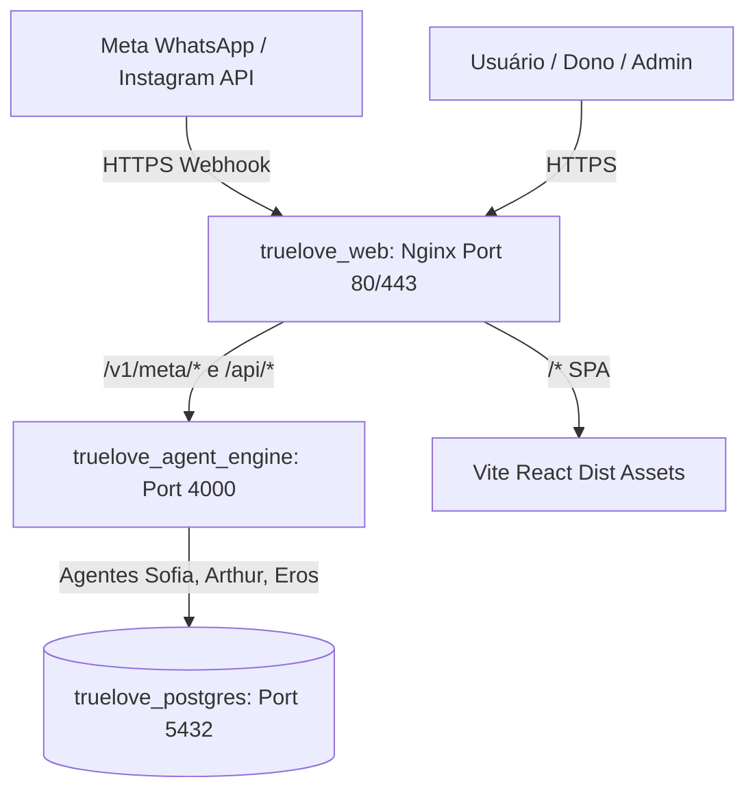

# 🚀 Guia de Implantação do True Love na VPS (Docker 1-Clique)

Este guia orienta a instalação do ecossistema completo do **True Love** em qualquer VPS (Hostinger, Contabo, Hetzner, DigitalOcean, AWS Lightsail, etc.) com Ubuntu 22.04 ou 24.04 LTS.

---

## 🏗️ Arquitetura em Contêineres na VPS



---

## ⚡ Passo 1: Preparar a VPS (Requisitos Mínimos)
- **VPS Recomendada**: 2 vCPUs, 2 GB a 4 GB RAM, 30 GB SSD (custo aprox. $4 a $8/mês)
- **Sistema Operacional**: Ubuntu 22.04 LTS / 24.04 LTS

Conecte-se via SSH:
```bash
ssh root@IP_DA_SUA_VPS
```

---

## ⚡ Passo 2: Instalação Automática (Docker + Docker Compose)

Execute o comando abaixo na VPS para atualizar o sistema e instalar o Docker:
```bash
sudo apt update && sudo apt upgrade -y
sudo apt install -y curl git ufw fail2ban

# Instalar Docker oficial
curl -fsSL https://get.docker.com -o get-docker.sh
sh get-docker.sh

# Habilitar inicialização automática
systemctl enable docker
systemctl start docker
```

---

## ⚡ Passo 3: Clonar o Repositório ou Fazer Upload

```bash
mkdir -p /var/www/truelove
cd /var/www/truelove

# Se tiver no GitHub ou repositório Git:
git clone <URL_DO_SEU_REPO> .

# Ou copie via rsync/scp da sua máquina:
# scp -r * root@IP_DA_SUA_VPS:/var/www/truelove/
```

---

## ⚡ Passo 4: Configurar as Variáveis de Ambiente (`.env`)

Crie o arquivo `.env` na raiz do projeto:
```bash
nano .env
```

Cole e preencha as variáveis:
```env
# Banco de Dados
POSTGRES_USER=truelove_admin
POSTGRES_PASSWORD=SuaSenhaForteAqui2026!
POSTGRES_DB=truelove_prod

# Meta Cloud API (WhatsApp & Instagram)
META_VERIFY_TOKEN=truelove_meta_token_secure_2026
META_ACCESS_TOKEN=EAA...
META_PHONE_NUMBER_ID=109283019283019
META_APP_SECRET=seu_meta_app_secret

# Chaves de IA (Opcionais - o sistema possui fallback heurístico inteligente integrado)
OPENAI_API_KEY=sk-...
ANTHROPIC_API_KEY=sk-ant-...
GEMINI_API_KEY=AIza...
```

---

## ⚡ Passo 5: Iniciar o Ecossistema

Suba os contêineres em segundo plano:
```bash
docker compose up -d --build
```

Verifique se todos os contêineres estão ativos:
```bash
docker compose ps
```

Você verá:
- `truelove_postgres` (Up, 5432)
- `truelove_agent_engine` (Up, 4000)
- `truelove_web` (Up, 80)

---

## ⚡ Passo 6: Configurar Domínio e SSL Grátis (Let's Encrypt / Certbot)

Para que a Meta aceite seu Webhook, **é obrigatório ter HTTPS com SSL válido**:

```bash
sudo apt install -y certbot python3-certbot-nginx

# Gerar certificado para o seu domínio (ex: app.truelove.com.br)
certbot --nginx -d seu-dominio.com.br
```

---

## ⚡ Passo 7: Cadastrar o Webhook no Painel Meta for Developers

1. Acesse o [Meta for Developers](https://developers.facebook.com/)
2. No seu App > **WhatsApp** > **Configuration**:
   - **Callback URL**: `https://seu-dominio.com.br/v1/meta/webhook`
   - **Verify Token**: `truelove_meta_token_secure_2026` (o mesmo do `.env`)
   - Clique em **"Verify and Save"**
3. Em **Webhook fields**, assine o evento:
   - `messages`
4. No **Instagram Graph API**:
   - Assine o evento `messages` e `messaging_postbacks`.

---

## 📊 Como testar se a Sofia está respondendo na VPS

1. Mande uma mensagem de teste para o seu WhatsApp Business:
   > *"Olá, vi o anúncio. Tenho 58 anos, moro em Brasília e busco um relacionamento sério."*
2. Veja o log em tempo real na VPS:
   ```bash
   docker compose logs -f agent_engine
   ```
3. A Sofia responderá imediatamente, qualificará o usuário como 35+, e o lead aparecerá automaticamente no **Painel do Dono > Funil de Vendas**!
